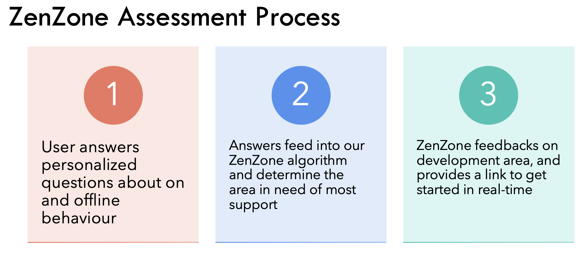

# ACSHack: ZenZone
# Repo Description
The winning solution for Imperial ACS 24Hr Hackathon 2022 sponsored by Google and The Alan Turing Institute.

## Challenge Description
" <strong>Help users manage online wellbeing </strong>   
For example you could build a chrome extension that for parents with young children.  
As the child opens a site, the site content is crawled to give a safety score based on the test and images."

## My Solution: ZenZone
The Problem
- Digital era means everything is uploaded, compared and judged
- Social media has been linked to higher rates of anxiety, depression
- 38% adults do not trust social media 
- Many users are dependent on digital content that contributes to poor mental health.

<strong>ZenZone </strong>

- ZenZone provides an alternatively positive online experience.
- Takes user input to assess wellbeing and find most relevant resources in real time.
- Equips people to take charge of their own wellbeing in face of global digitalisation.
- Target Audience of: 18-49 year olds.

Assessment Process  

## Technologies  
The solution was built using the following technologies.  
Backend/Server: Flask and Python. 
Frontend: HTML, CSS, BootStrap. 

## Images of ZenZone
Homepage

ZenZone Assessment

Feedback Page

